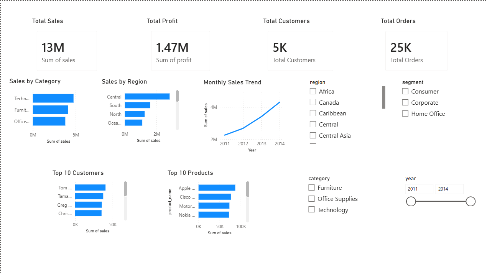
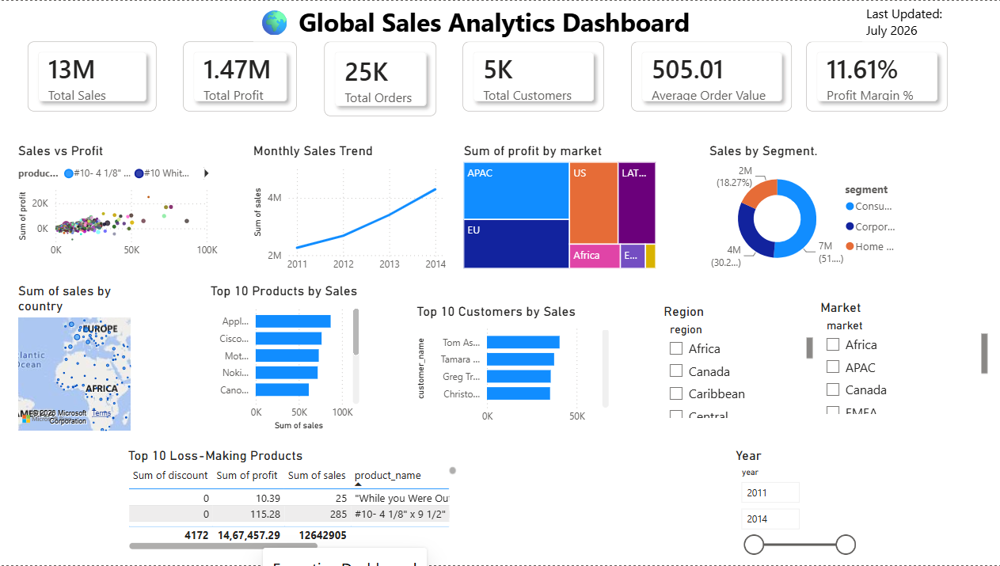
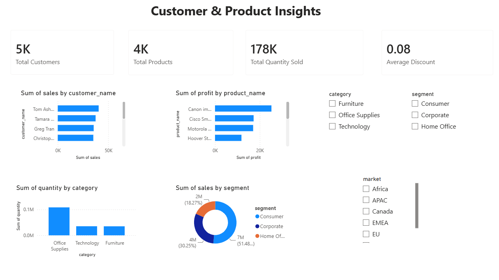

# 📊 Global Sales Analytics System

An end-to-end Sales Analytics project built using **Python, MySQL, SQL, Power BI, Pandas, and Streamlit**. This project demonstrates the complete data analytics workflow, from data cleaning and database creation to business intelligence dashboards and insights.

---

## 🚀 Project Overview

This project focuses on analyzing global sales data to help businesses make informed decisions through interactive dashboards and SQL-based analysis.

The workflow includes:

- Data Cleaning using Python
- ETL Process
- MySQL Database Design
- Advanced SQL Queries
- Power BI Dashboard
- Business Insights
- Streamlit Dashboard (Under Development)

---

# 🛠 Tech Stack

- Python
- Pandas
- MySQL
- SQL
- Power BI
- Streamlit
- Git
- GitHub

---

# 📂 Project Structure

```
SQL-Python-PowerBI-Sales-Analytics
│
├── analysis/
├── data/
├── database/
├── powerbi/
│   └── Global_Sales_Analytics.pbix
├── reports/
├── screenshots/
│   ├── page1.png
│   ├── page2.png
│   └── page3.png
├── sql/
├── visuals/
├── app.py
├── requirements.txt
└── README.md
```

---

# 📊 Dashboard Preview

## Dashboard Page 1



---

## Dashboard Page 2



---

## Dashboard Page 3



---

# 📈 Key Features

- Data Cleaning using Python
- MySQL Database Integration
- SQL Queries for Business Analysis
- Interactive Power BI Dashboard
- KPI Analysis
- Regional Sales Analysis
- Category Performance
- Profit Analysis
- Customer Insights
- Sales Trend Analysis

---

# 📌 Business Insights

The dashboard helps answer business questions such as:

- Which region generates the highest sales?
- Which category is the most profitable?
- Which products perform the best?
- What are the monthly sales trends?
- Which customers contribute the highest revenue?

---

# ▶️ How to Run

## Clone Repository

```bash
git clone https://github.com/devanshivarma00536/SQL-Python-PowerBI-Sales-Analytics.git
```

## Install Dependencies

```bash
pip install -r requirements.txt
```

## Run Streamlit

```bash
streamlit run app.py
```

## Open Power BI Dashboard

Navigate to:

```
powerbi/Global_Sales_Analytics.pbix
```

and open it using **Microsoft Power BI Desktop**.

---

# 👩‍💻 Author

**Ellamaraju Devanshi Varma**

- LinkedIn: https://linkedin.com/in/ellamaraju-devanshi-varma-aa0891314
- GitHub: https://github.com/devanshivarma00536

---

⭐ If you found this project useful, consider giving it a star.